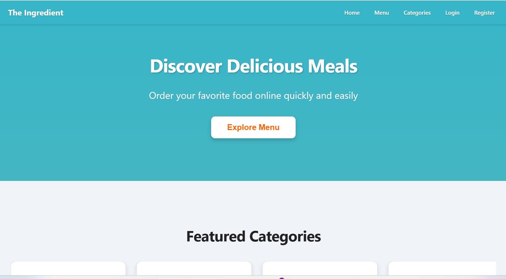
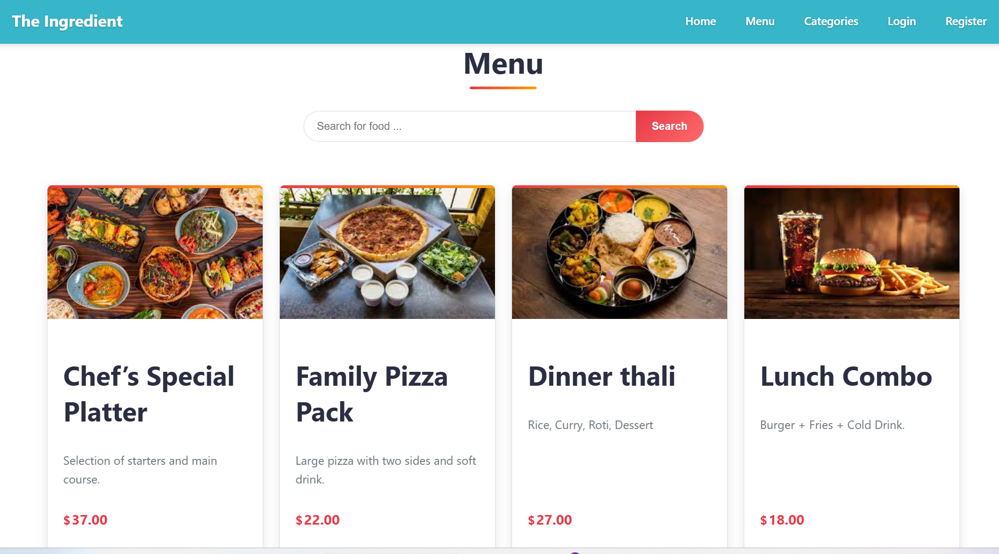
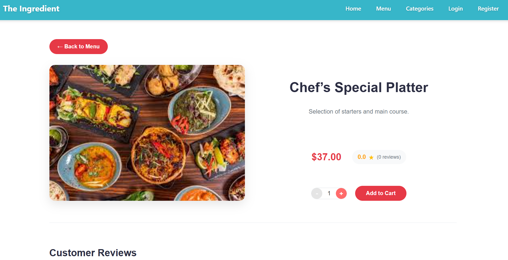
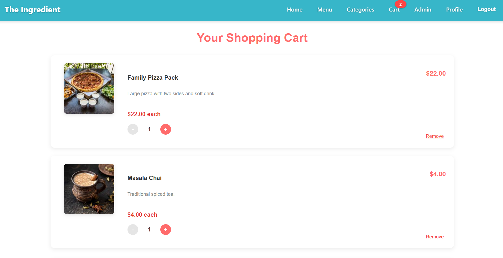
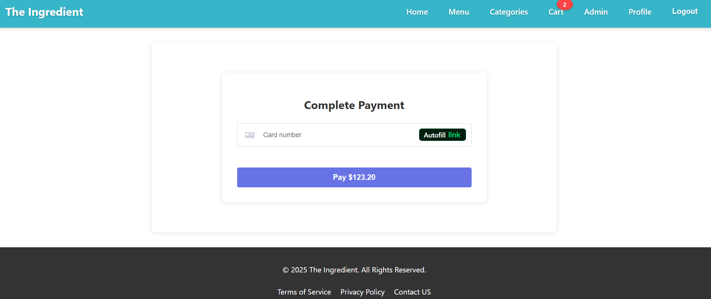
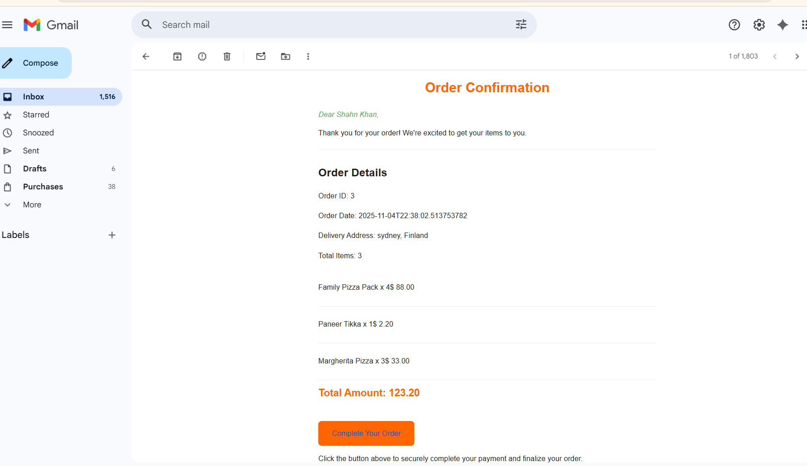
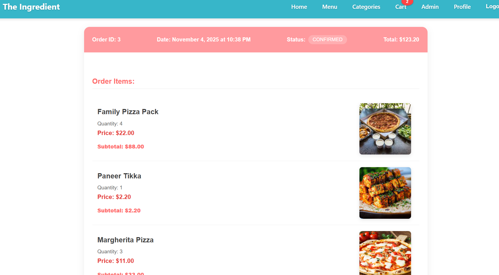
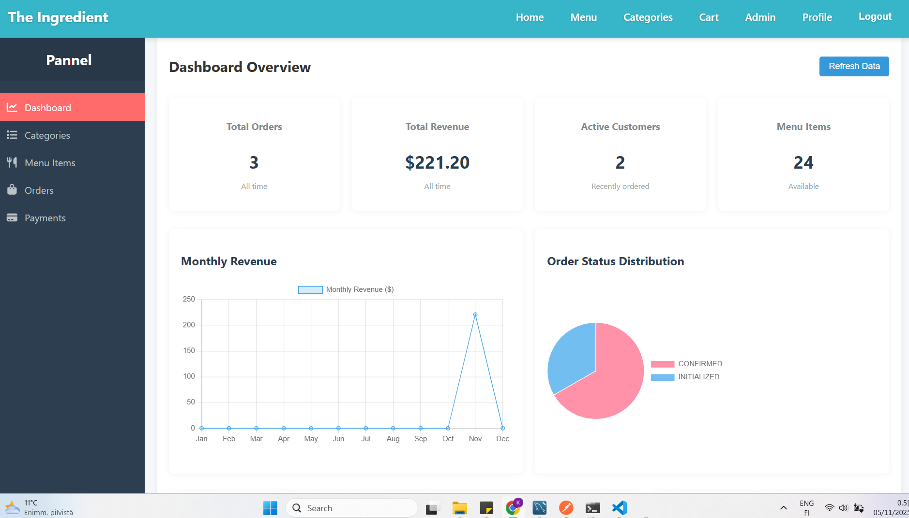
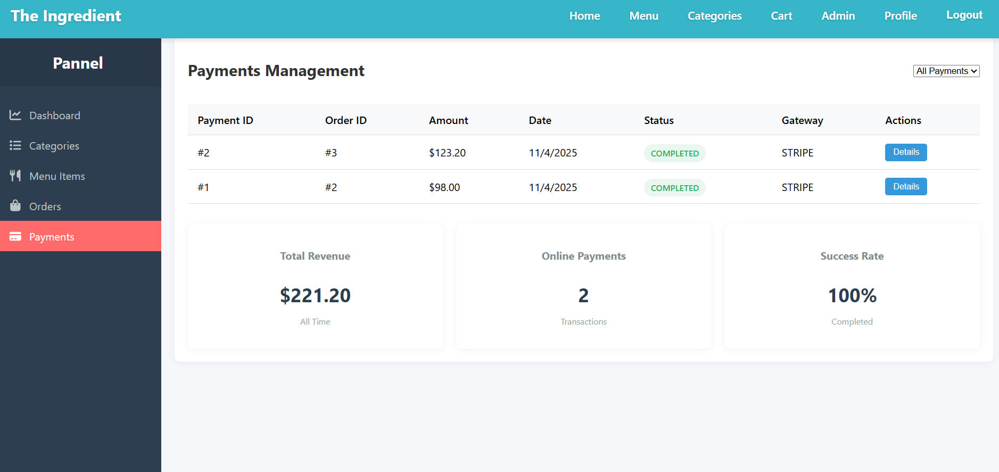

# Full Stack Food Ordering Application

 -- A complete full-stack food ordering application with React frontend and Spring Boot backend, featuring user authentication, payment processing, and real-time order tracking.

##  Project Overview

A modern food delivery platform demonstrating full-stack development skills with proper testing, documentation, and production-ready features.

**Live Demo**:  http://foodapp-dev-1995.s3-website.eu-north-1.amazonaws.com/home 

**Video Demo**: https://youtu.be/WWB3-JPfarQ

#  Screenshots

- **Home Page**  
  

- **Menu Page**  
  

- **Menu Details**  
  

- **Cart Page**  
  

- **Payment Page**  
  

- **Order Confirmation Email**  
  

- **Previous Orders**  
  

- **Admin Dashboard**  
  

- **Payment Management (Admin)**  
  

## 🛠 Tech Stack

**Frontend**: React, JavaScript, HTML5, CSS3  
**Backend**: Spring Boot, Java 21, Maven  
**Database**: MySQL 8.0  
**Authentication**: JWT  
**Payment**: Stripe Integration  
**Storage**: AWS S3  
**Other**: REST APIs, Responsive Design

## Quick Start

### Prerequisites
- Java 21
- Node.js 16+
- MySQL 8.0
- Maven

### Installation

1. **Clone the repository**

git clone https://github.com/factor-4/Food-Order-App-Fullstack.git
cd food-order-app-fullstack

## Backend Setup

cd backend 
Configure application.properties with your database credentials

- Using Maven Wrapper (recommended - works without Maven installation)
- mvnw.cmd spring-boot:run   # Windows Command Prompt
- .\mvnw.cmd spring-boot:run # Windows PowerShell
- ./mvnw spring-boot:run     # macOS/Linux

# Alternative: If you have Maven installed globally
mvn spring-boot:run

# Frontend Setup

- cd frontend
- npm install
- npm start
See frontend README for detailed setup

## API Documentation

The backend provides a comprehensive REST API for managing users, menu items, orders, payments, and reviews. Full interactive documentation is available via Swagger UI - 
http://16.171.29.151:8090/swagger-ui/index.html
.

# Authentication

POST /api/auth/register – Register a new user

POST /api/auth/login – Login and obtain authentication token

# User Management

GET /api/users/account – Get details of the logged-in user

PUT /api/users/update – Update logged-in user details (supports profile image upload)

DELETE /api/users/deactivate – Deactivate logged-in user account

GET /api/users/all – List all users (Admin only)

# Role Management (Admin only)

POST /api/roles – Create a new role

PUT /api/roles – Update an existing role

GET /api/roles – List all roles

DELETE /api/roles/{id} – Delete a role

# Category Management

POST /api/categories – Add a new category (Admin only)

PUT /api/categories – Update an existing category (Admin only)

GET /api/categories/{id} – Get category by ID

GET /api/categories/all – List all categories

DELETE /api/categories/{id} – Delete category (Admin only)

# Menu Management

POST /api/menu – Create a new menu item (Admin only, supports image upload)

PUT /api/menu – Update menu item (Admin only, supports image upload)

GET /api/menu/{id} – Get menu item by ID

GET /api/menu – List all menu items (optional: filter by category or search)

DELETE /api/menu/{id} – Delete menu item (Admin only)

# Cart Management

POST /api/cart/items – Add an item to the cart

PUT /api/cart/items/increment/{menuId} – Increment quantity of a cart item

PUT /api/cart/items/decrement/{menuId} – Decrement quantity of a cart item

DELETE /api/cart/items/{cartItemId} – Remove item from cart

GET /api/cart – View current shopping cart

DELETE /api/cart – Clear shopping cart

# Order Management

POST /api/orders/checkout – Place an order from the cart (Customer only)

GET /api/orders/{id} – Get order by ID

GET /api/orders/me – Get all orders of the logged-in user

GET /api/orders/order-item/{orderItemId} – Get specific order item

GET /api/orders/all – List all orders (Admin only, filterable by status)

PUT /api/orders/update – Update order status (Admin only)

GET /api/orders/unique-customers – Count unique customers (Admin only)

# Payment Management

POST /api/payments/pay – Initialize payment for an order

PUT /api/payments/update – Update payment status for an order

GET /api/payments/all – List all payments (Admin only)

GET /api/payments/{paymentId} – Get payment by ID

# Review Management

POST /api/reviews – Add a review for a menu item

GET /api/reviews/menu-item/{menuId} – Get all reviews for a menu item

GET /api/reviews/menu-item/average/{menuId} – Get average rating for a menu item

## Key Features
-- Authentication & Security
-- JWT-based authentication
-- Role-based access control (Customer, Admin, Delivery)
-- Secure password handling
-- Payments & Orders
-- Stripe payment integration
-- Real-time order tracking
-- Email notifications
-- Shopping cart management
-- Order history
-- Architecture
-- RESTful API design
-- Database relationships with complex queries
-- File upload handling with AWS S3
-- Proper error handling
--Users, Menu Items, Orders, Order Items tables
-- Proper foreign key relationships
-- Complex queries for order management

# Testing

# Backend tests
cd backend && mvn test

# Frontend tests  
cd frontend && npm test